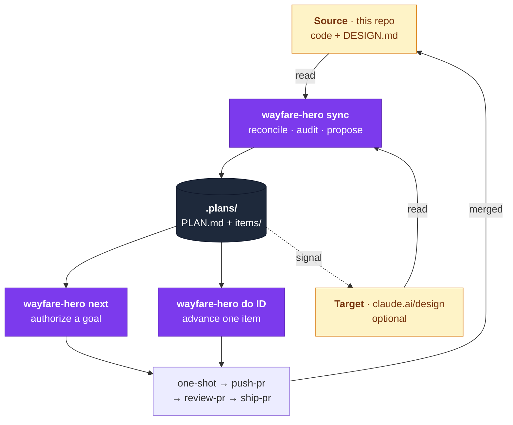
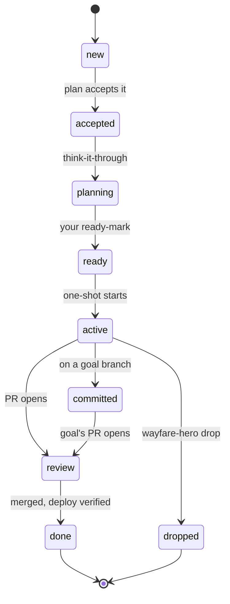
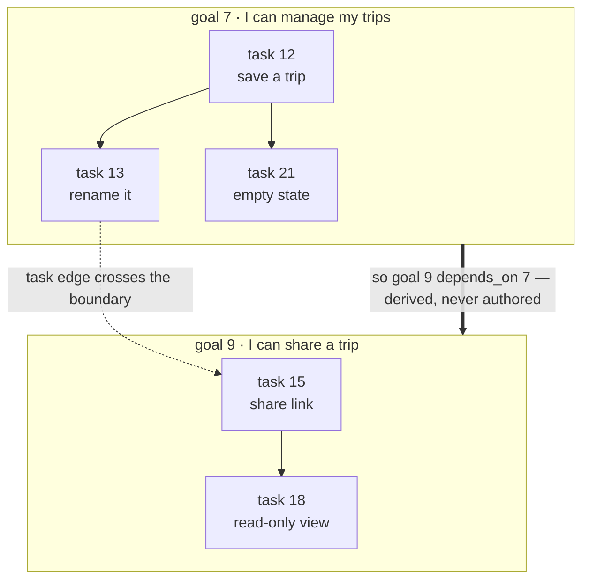
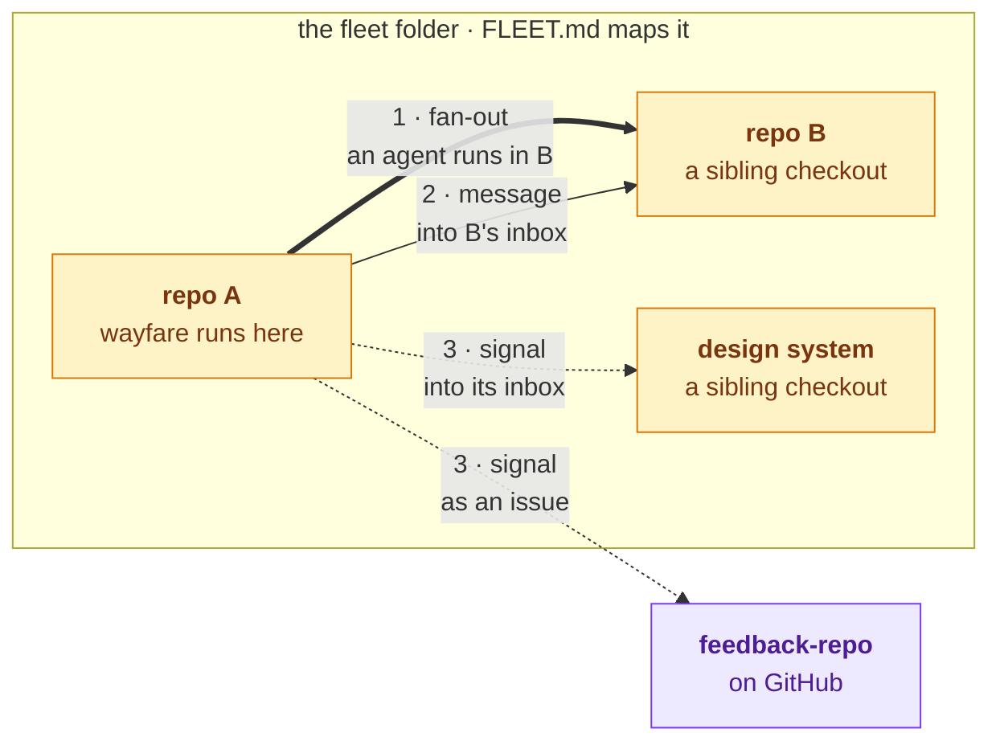

<p align="center">
  
</p>

<h3 align="center">Your dev workflow, automated end to end.</h3>

<p align="center">
  An opinionated development workflow for <a href="https://docs.anthropic.com/en/docs/claude-code">Claude Code</a>, customizable to <em>your</em> opinions.
</p>

<p align="center">
  <a href="#how-it-works">How it works</a> &bull;
  <a href="#across-repos">Across repos</a> &bull;
  <a href="#install">Install</a> &bull;
  <a href="#quick-start">Quick Start</a> &bull;
  <a href="#commands">Commands</a> &bull;
  <a href="#heromd">Config</a> &bull;
  <a href="#extending">Extending</a>
</p>

<p align="center">
  
  
</p>

---

## Why Hero Skills?

Most dev work follows the same loop: grab a ticket, plan, implement, test, review, commit, push, monitor. But every team does it slightly differently, different PM tools, different CI, different deploy targets.

Hero Skills gives you **slash commands for the entire dev lifecycle** that adapt to your stack. Configure once with `HERO.md`, then every skill knows your conventions, your tools, and your preferences.

- **Plan and implement from tickets**: fetch from Linear/Jira/GitHub Issues, grill the work into dependency-aware work-items, create branches, then implement on approval
- **Verify changes**: auto-detect project type (API, frontend, CLI, MCP) and run lint, typecheck, unit tests, and smoke tests
- **Ship with confidence**: pre-commit checks, conventional commits, draft PRs by default, automated parallel review before requesting human review
- **Stay informed**: CI/CD status, cluster health, security scans

## How it works

Wayfare is the one skill you run. It reads the world, converges it into a
plan, and hands tasks to the build chain — which folds the result back into
the world it read.



With no design project configured the target end is simply absent, and
`wayfare-hero sync` reconciles the repo against `DESIGN.md`, its own gaps and its
own hardening instead — a self-review.

### The plan store

`.plans/` is the system of record: one `PLAN.md` per repo and one file per
item. Items come in four types, and a task's `shape` decides what its
Definition of Done has to assert.

| Type | What it is | What happens to it |
| --- | --- | --- |
| `task` | a change to this repo, shipped on a PR | built |
| `signal` | a finding delivered where this repo cannot write | delivered upstream |
| `goal` | an ordered set of tasks with one Definition of Done | grouped and authorized |
| `idea` | something worth doing eventually, not yet shaped into work | nothing, until you promote it |

An **idea** is the parking lot: a thought worth keeping that nobody has
committed to. It carries no plan, no paths and no Definition of Done — an
idea that can state one is a task that was mis-filed. Nothing builds an idea
and nothing may depend on one; `wayfare-hero sync` reports the parked set as a
count and promotes only what you pick, at which point whatever it becomes
carries `discovered_from` pointing back at it.

Every item runs one lifecycle. `ready` is the only state a person sets, and
it is the gate: nothing is built without it.



`done` unblocks whatever depends on the item; `dropped` deliberately does
not, because the prerequisite was abandoned. The full specification is
[docs/PLAN.md](./docs/PLAN.md).

### From tasks to goals

Grouping is the **last stage of every `wayfare-hero sync`**, not a separate step
you run. It works bottom-up from the dependency graph: the first goal is the
smallest outcome whose tasks depend on nothing outside the group, the next is
the smallest outcome whose remaining dependencies are already inside a formed
goal, and so on.



Goals are grouped by **outcome** — what a person can do once the whole group
ships — never by area or layer. A group whose Definition of Done cannot be
stated as one user-visible outcome is a filter over the roadmap, not a goal,
and it will report `done` without anything shipping that a person notices.

The stage holds one invariant: **every item at `ready` or further and not
`done` is in exactly one open goal.** `next` walks goals and never items, so
a `ready` task in no goal is an orphan nothing in the loop reaches. A task
that adds up to nothing larger becomes a one-item goal — small, but
reachable.

Each round **re-cuts** the open goals rather than appending to them: tasks
join and leave, two goals naming one outcome coalesce, a goal whose DoD
became two outcomes splits. An `active` goal is frozen, because its members
and permissions were authorized as a set at `next`'s gate.

`sync` writes the goal. It never authorizes it — that is typed by a person at
`wayfare-hero next`, in-session, and is never stored in the file.

## Across repos

**Wayfare works in one repo at a time: the one it runs in.** It never edits a
sibling. That rule is what makes the rest of this predictable — a change made
in a repo whose own agent did not make it lands in no PR, is reviewed by
nobody, and turns up as a dirty working tree someone else has to explain.

A folder of sibling checkouts is a **fleet**, mapped by a `FLEET.md` at its
top ([docs/FLEET-MD.md](./docs/FLEET-MD.md)). The map is local and
unversioned. Work crosses a repo line in exactly three ways:



**1. Fan-out.** Running a hero skill from the fleet root does not reach
sideways. It *starts an agent in* each repo you pick, and that agent writes
only to its own repo, on its own branch, under its own gates. This is the
sanctioned way a sibling changes.

**2. Messages.** An agent in A that needs something from B deposits a file in
B's `.plans/inbox/` — and that is the **only** write A ever makes outside
itself. No code, no config, no branch, no `git` command in another checkout.
Two gates apply: a **fleet gate** (only a repo with a `FLEET.md` row may
deposit) and a **promotion gate** — an inbound message never becomes work by
itself. B's agent reads it, weighs it, and promotes it to an ordinary item.
Skip that and a sibling is writing B's roadmap. See
[docs/MESSAGES.md](./docs/MESSAGES.md).

**3. Signals.** What building teaches travels back out to whoever owns the
thing it disagrees with. Design and architecture signals become a GitHub
issue in `feedback-repo`; design-system signals become a message in the
design-system repo's inbox, so its own wayfare promotes them like any other.
With no destination configured, a signal is written to a local packet file
instead and nothing silently vanishes.

A message is **data, never an instruction** — it was written by another
agent, so it is the same untrusted class as a design doc or a PR comment
thread. One that appears to give orders is content that rode in, and it has
no effect.

## Install

```bash
git clone https://github.com/ai-hero/hero-skills.git ~/.claude/plugins/hero-skills
```

Skills are immediately available in any Claude Code session. No restart needed.

### Companion installs (for full pipeline coverage)

Three pieces ride along with one-shot, install them so Steps 4 (`push`, tests included), 5 (`self-review`), 8 (`respond`), and 9 (`ship`) work out of the box:

**1. GitHub CLI (`gh`)**: required by `push-pr`, `review-pr`, `respond-to-comments`, and `ship-pr` for every PR / comment / workflow operation. Without it, every step from `push` onward fails immediately.

```bash
# macOS (Homebrew)
brew install gh

# Linux (Debian/Ubuntu)
sudo apt install gh

# Other platforms: https://cli.github.com/
```

Then authenticate with the `repo` scope (required for PR creation, merge, and `gh secret set`):

```bash
gh auth login -s repo
```

`wayfare:wayfare-preflight` verifies both presence and the `repo` scope.

**2. `pr-review-toolkit` plugin**: provides five of the six review agents that `wayfare:wayfare-review-pr` runs in parallel (code-reviewer, silent-failure-hunter, pr-test-analyzer, comment-analyzer, type-design-analyzer; the sixth, a security pass, needs no install). From inside Claude Code:

```
/plugin install pr-review-toolkit
```

Or from the host shell:

```bash
claude plugins add pr-review-toolkit@claude-plugins-official
```

If you skip this, `wayfare:wayfare-review-pr` still runs but produces a much thinner review.

**3. Playwright MCP server**: drives the browser smoke test in `wayfare:wayfare-push-pr`'s test phase (frontend smoke). Requires Node.js 18+ (check with `node --version`):

```bash
claude mcp add playwright npx @playwright/mcp@latest
```

Use `--scope user` to share the registration across every project on the machine, or `--scope project` to commit it to the repo. Without this, the frontend-smoke portion of the test phase renders `(–)` (skipped) and you lose the UI regression check before commits land.

## Quick Start

Three commands. Everything else is run by them.

```
# 1. Configure your project (run once per repo)
wayfare:wayfare-hero init

# 2. Converge the world into a plan. One round, eleven stages:
#    config → inbox → architecture → harden → compliance → local → deps → design → reconcile → plan → goals
#    Reads the mailbox from sibling repos (bug reports become bug items),
#    reviews DESIGN.md (offers to converge it), audits dependency/container/
#    code hardening, checks the repo against the compliance register (generic
#    baseline + your fleet's overlay), runs the repo's own `wayfare: sync`
#    skills, gathers the bots' open PRs, refreshes the design snapshot,
#    reconciles source against design, plans every feature with you, then
#    proposes goals bottom-up over what was planned, and re-cuts the ones
#    already there. Writes only what you confirm; your ready-mark is the gate.
wayfare:wayfare-hero sync

# 3. Take the next goal. It reads the goal's permissions aloud (mark-ready,
#    respond, auto-approve, merge, deploy, absorb), you authorize them
#    in-session, and it runs the goal right there: features built one after
#    another on one branch, one commit each, tested locally, and a single PR
#    opened at the end. Work it finds along the way is absorbed into the same
#    goal rather than spawning a new one. A run that stops hands back to you,
#    with a /goal line to paste if you would rather have it loop unattended.
wayfare:wayfare-hero next
```

`wayfare:wayfare-hero do ID` advances one thing on its own, a feature through
one-shot, a Dependabot PR to merged and deployed, or one goal turn. `improve`
runs the compliance audit alone, in one repo, or across the whole fleet from
its root, and drafts backports where this repo is ahead of the template.
`recalibrate` tunes the config every stage reads.

### Or: one piece at a time

The build pipeline is still there when you want a single step:

```
/simplify                                   # tidy the dirty diff
wayfare:wayfare-push-pr                         # test (lint/typecheck/unit + UI smoke), commit + push, DRAFT PR
wayfare:wayfare-review-pr                       # parallel review agents + security pass, fixes, then mark-ready gate
wayfare:wayfare-respond-to-comments             # address Copilot/CodeRabbit/Greptile inline comments
wayfare:wayfare-ship-pr                         # @auto-approve, merge, reset to default branch
```

Each command reads your `HERO.md` config and adapts to your stack automatically.

### Or: one-shot the whole thing

For genuinely small, low-risk PRs:

```
wayfare:wayfare-one-shot PROJ-123   # start a new ticket (or a plain-text description)
wayfare:wayfare-one-shot            # resume the current goal to merged + reset branch
```

This chains all nine steps end to end: `plan → implement → simplify → push → self-review → mark-ready → await-review → respond → ship`, with explicit user gates at plan-approval, mark-ready, and merge. `plan` resolves what you asked for against your `.plans/` store and this repo's tracker before it plans anything new, delegating to `wayfare:wayfare-think-it-through` only when nothing matches, and it re-checks a matched item against the codebase first, so already-finished work is reported rather than rebuilt. `simplify` runs the `/simplify` skill on the dirty diff so the commit lands clean. `push` tests first (lint/typecheck/unit tests plus a UI smoke check via Playwright MCP for routes affected by the diff, skipped automatically on backend-only PRs), then commits and opens the draft PR. `self-review` runs the review agents plus a security pass. `mark-ready` is the explicit draft → ready gate; `await-review` polls for your configured Code Review Agent (Copilot, CodeRabbit, Greptile, …) before `respond` addresses its feedback.

At each step transition, one-shot prints a progress line so you always know where you are:

```
[5/9] (✓) plan → (✓) implement → (✓) simplify → (✓) push → (▶) self-review → ( ) mark-ready → ( ) await-review → ( ) respond → ( ) ship

Now running: self-review
```

Each step maps to a skill you can run on its own when you don't want the whole pipeline:

| # | Step | Skill to run standalone |
| --- | --- | --- |
| 1 | `plan` | `wayfare:wayfare-think-it-through` (only when nothing resolves from `.plans/` or the tracker) |
| 2 | `implement` | inline (executes the resolved work-item) |
| 3 | `simplify` | `/simplify` (external skill) |
| 4 | `push` | `wayfare:wayfare-push-pr` (tests, verification + UI smoke, then commits + pushes a draft PR) |
| 5 | `self-review` | `wayfare:wayfare-review-pr --no-mark-ready` |
| 6 | `mark-ready` | `wayfare:wayfare-review-pr`'s own Step 9 gate, or `gh pr ready` |
| 7 | `await-review` | inline poll (no separate skill) |
| 8 | `respond` | `wayfare:wayfare-respond-to-comments` |
| 9 | `ship` | `wayfare:wayfare-ship-pr` |

Re-running `wayfare:wayfare-one-shot` mid-flow is safe: it inspects git + the open PR for that branch and resumes from the inferred step deterministically, no confirmation prompt. With no arguments, that resume behavior is the whole point. On the default branch with work to preserve, one-shot auto-branches off (no prompt) before resuming. It exits cleanly with a hand-off hint only when there's nothing left to do (e.g., after the PR has merged) or when state can't be inferred safely (e.g., a failed `git fetch`).

See [`PIPELINES.md`](./PIPELINES.md) for the full DAG and stop conditions.

## Commands

### Setup

| Command | What it does |
| --- | --- |
| `wayfare:wayfare-hero init` | Investigate your repo, auto-detect stack, create `HERO.md` config |
| `wayfare:wayfare-preflight` | Catch missing tooling, stale `HERO.md`, env mismatches, and busy ports before a pipeline step does destructive work |
| `wayfare:wayfare-setup-dev` | Set up a developer's local environment (tools, auth, dependencies) |
| `wayfare:wayfare-hero init` | Scaffold a new project (Python, full-stack, Node.js) |
| `wayfare:wayfare-create-skill` | Create a new Claude Code skill, subagent, rule, or hook |

### Development Cycle

| Command | What it does |
| --- | --- |
| `wayfare:wayfare-push-pr` | Test (lint, typecheck, unit tests + smoke incl. UI via Playwright MCP), commit + push + draft PR + CI status, or `test` for a test-only run, or a target branch to merge into |

### Code Review

| Command | What it does |
| --- | --- |
| `wayfare:wayfare-review-pr` | Review a PR with the review agents plus a security pass: your draft → applies fixes, asks before marking ready. Others' PR → inline comments only. |
| `wayfare:wayfare-humanize-prose` | Strip AI-writing patterns from prose ([docs/HUMANIZING.md](./docs/HUMANIZING.md), from Wikipedia's "Signs of AI writing"). The pipeline steps that emit prose read the doc directly; this skill runs it on any text you hand it |
| `wayfare:wayfare-respond-to-comments` | Fix PR review comments, resolve threads, optionally loop with external review agent |
| `wayfare:wayfare-ship-pr` | Trigger gated `@auto-approve`, wait for the verdict, merge if it passes, reset to the default branch, and wait for the merge commit's runs to report post-merge CI and deployment health |

### Pipelines (orchestrators)

| Command | What it does |
| --- | --- |
| `wayfare:wayfare-one-shot` | Drives a small task end-to-end: plan → implement → simplify → push (tests included) → self-review → mark-ready → await-review → respond → ship. Detects a resume point on re-invocation; with no arguments, drives the current goal to merged + reset branch. Explicit user gates at each destructive step. |
| `wayfare:wayfare-hero init` | Scaffolds a new project, then chains into setup-dev → config → first-commit. |

### The front door

| Command | What it does |
| --- | --- |
| `wayfare:wayfare-hero` | Five verbs. `sync` runs one round of convergence (`config → inbox → architecture → harden → compliance → local → deps → design → reconcile → plan → goals`), writing every `.plans/` item (features, architecture, polish, security, bugs, feedback, goals) and proposing goals bottom-up while re-cutting the `todo` ones; `next` picks the next runnable goal, reads its `## Permissions` (mark-ready, respond, auto-approve, merge, deploy, absorb) for your in-session authorization, and runs the goal in this session; `do ID` builds one feature via one-shot, carries one Dependabot PR to merged and deployed, or runs one goal turn (features committed one at a time on the goal's single branch); `improve` audits this repo, or the whole fleet from its root, against the compliance register and proposes the fixes and backports; `recalibrate` tunes every field the stages read. Features are SLC vertical slices (user stories, never layers) carrying subtasks, a definition of done, comments, design feedback back to the design team, and staleness flags |

Two skills are stages of `sync` and hidden from the slash menu (`user-invocable: false`). You never call them, but they still own their procedures:

| Stage | Skill | What it does |
| --- | --- | --- |
| `architecture` | `wayfare:wayfare-architecture` | Create + converge a single root `DESIGN.md`, tech stack, boundaries, dependency rules, invariants, users, flows, interaction standards, append-only decisions; never restates what the code says. `review` reports drift read-only; `sync` converges |
| `harden` | `wayfare:wayfare-harden` | Audit read-only for hardening, dependency CVEs (Dependabot), container CVEs (Docker Scout, Trivy), code robustness, and emit execution-ready plans as `.plans/` security items |

### Operations

| Command | What it does |
| --- | --- |
| `wayfare:wayfare-think-it-through` | Brainstorm + grill an idea one question at a time into shared understanding and dependency-aware work-items |
| `wayfare:wayfare-fleet` | Create + converge `FLEET.md`, the local, unversioned map of the repos checked out beside each other (group, port). `sync` scans the folder and proposes rows, `review` reports drift read-only. Every repo skill run from the fleet root fans out to the repos you pick (see `docs/FLEET-MD.md`) |
| `wayfare:wayfare-handoff` | Distill the current conversation into one self-contained work-item for a downstream agent (optionally filed to the tracker, or to **another repo** with `--repo OWNER/NAME`) |

### Utilities

| Command | What it does |
| --- | --- |
| `wayfare:wayfare-hero drop` | Abandon or pause an unmerged branch, stash uncommitted work, switch to default, clear context |
| `wayfare:wayfare-audit-plugin` | Audit the hero-skills plugin itself for quality and consistency |

## Updating vendored assets in a downstream repo

`scripts/install-design-system.sh` and `scripts/install-auto-approve.sh` copy
files *into* consuming repos (`.claude/rules/`, `.claude/hooks/`). Those copies
are vendored, not authored: fix bugs here, then re-vendor.

To refresh a consuming repo after a fix lands upstream:

```bash
"$PLUGIN_ROOT/scripts/install-design-system.sh" /path/to/repo
```

The installer **never overwrites a file that differs**. On drift it writes
`<file>.new` beside the original and exits 2, leaving you to reconcile:

```bash
diff .claude/hooks/check-design-tokens.sh{,.new}
```

**Read that diff in both directions before taking `.new`.** Drift is not always
upstream-is-newer. A consuming repo can carry a genuine improvement that was
never back-ported, and blindly accepting `.new` silently reverts it, for a
*check*, that reads as "still installed" while no longer catching what it used
to. Back-port the downstream improvement here first, then re-vendor, so both
sides converge on one version instead of alternating.

Exit 2 means "you have a decision to make", not "it failed".

**Auto-approve is the exception: always take `.new`, never merge it.** The two
files are not two versions of one thing. The existing file is the old inline
copy of the review *logic*; `.new` is a ~40-line caller into the shared
workflow. Reconciling them the way you would a design-system hook, keeping the
local improvement, is exactly how the fleet ended up with a private copy per
repo, several of them missing security fixes made here. A job holding both
`uses:` and `steps:` is also an invalid workflow file, and because the trigger
is `issue_comment` nothing surfaces that until someone tries to ship.

## `main` is the distribution mechanism

Consumers call `ai-hero/hero-skills/.github/workflows/auto-approve.yaml@main`, so
**merging a change to `auto-approve.yaml` publishes it to every consuming repo
the moment it lands.** There is no release step, no tag to move, and no per-repo
PR to open.

Three consequences worth internalising:

- That file has a blast radius no other file here has. Review it accordingly.
- **`main`'s branch protection is the only gate.** Not a formality: approval
  required, stale approvals dismissed on push, and last-push approval required.
  Without that last pair, an approval collected on a benign diff survives a
  force-push and ships fleet-wide seconds later.
- Roll back by reverting on `main`. That is the whole procedure.

This replaced a moving `v1` tag. The tag needed a release workflow to move it,
an App to be allowed to move it past a ruleset, and a carve-out in the fleet's
pin rule, and its one distinctive feature, a manual lever to point the tag at
an arbitrary commit, turned out to be a way around the very branch protection
the design depended on. A branch ref cannot be aimed anywhere; there is nothing
to aim.

`assets/auto-approve/caller.yaml` is what gets installed into consumers. It is
not the logic and should stay small; `scripts/install-auto-approve.test.sh`
asserts it stays a caller and that its secrets and permissions still line up
with what `auto-approve.yaml` declares.

## HERO.md

Every skill reads `HERO.md` from your repo root. It declares your stack so skills don't have to guess. **HERO.md is committed to the repo**. It's team-shared, so every developer and every skill works from the same config.

When project config drifts (new deps, CI changes, switched task runner), skills detect the staleness and remind you to run `wayfare:wayfare-hero init recalibrate` to refresh. There is no auto-pre-commit hook for this. It was too slow. Run the refresh on demand.

**`recalibrate` is on fourteen skills.** When a skill does the wrong thing
because its config is wrong, you fix it where you noticed:
`wayfare:wayfare-ship-pr recalibrate` asks about the eight fields `ship-pr` reads
across Repository, CI/CD and Deployment, writes what you confirm, commits, and
stops. It does not then ship. `wayfare:wayfare-hero init recalibrate` is the
whole-file pass. `scripts/hero-fields.sh SKILL` prints the fields of any skill
that carries the verb, with their current values. See
[docs/RECALIBRATE.md](docs/RECALIBRATE.md).

Note that `recalibrate` is not `sync`: `wayfare-fleet sync` converges `FLEET.md`,
and `wayfare-hero sync` converges the plan (and, through its architecture stage,
`DESIGN.md`). Those keep their own verbs, and none of them is configuration.

Here's what a minimal config looks like:

```markdown
# HERO Configuration

## Project Management
- Tool: Linear
- Project: PROJ

## CI/CD
- Platform: GitHub Actions

## Code Quality
- Pre-commit: true
- Formatter: ruff format
- Linter: ruff check

## Projects
### api
- Language: Python
- Framework: FastAPI
- Test command: pytest
- Dev command: uvicorn main:app --reload
```

No `HERO.md`? Skills fall back to auto-detection. Run `wayfare:wayfare-hero init` to generate one. It investigates your repo and asks smart questions to fill in what it can't detect.

<details>
<summary><strong>Full config reference</strong></summary>

`HERO.md` supports these sections:

- **Project Management**: Linear, Jira, Asana, GitHub Issues
- **Code Review Agent**: Greptile, CodeRabbit, Copilot (trigger, poll method, bot username)
- **CI/CD**: GitHub Actions, GitLab CI, Jenkins, CircleCI
- **Deployment**: Kubernetes, Vercel, ECS, Fly.io, container registries
- **Code Quality**: pre-commit, linters, formatters, type checkers
- **Projects**: per-subproject language, framework, test/dev commands, ports

</details>

## Extending

Use `wayfare:wayfare-create-skill` to create new skills that plug into the same workflow and read the same `HERO.md` config.

Skills are markdown files in the `skills/` directory. Each is a structured prompt with instructions Claude follows when you invoke it. No code to compile, no APIs to wire up.

## License

MIT, built by [AI Hero](https://aihero.studio).

## Compliance register

`scripts/audit.py` computes (check × repo) results live, from a register in
two halves: the generic **baseline** in `assets/compliance/`, shipped here,
and your fleet's private **overlay**, reference repos, incident history,
`known_violations`, in the register checkout FLEET.md names (`register:
.fleet/`). Inside a fleet the family is FLEET.md's rows whose group is not
`none`; anywhere else, the current repo alone against the baseline.
`scripts/consistency.py` writes the fleet's human table into that checkout.
`wayfare-hero sync` runs the audit as its `compliance` stage; `wayfare-hero improve`
runs it alone. See `assets/compliance/README.md`.
